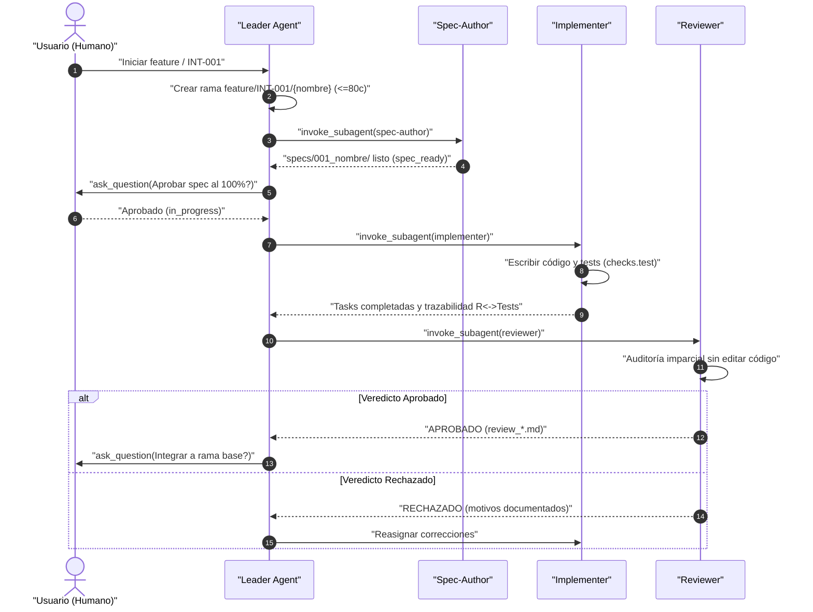

# Flujo de Orquestación Multi-Agente: agent-orchestrator

```mermaid
sequenceDiagram
  autonumber
  actor Humano as "Usuario (Humano)"
  participant Leader as "Leader Agent"
  participant SpecAuthor as "Spec-Author"
  participant Implementer as "Implementer"
  participant Reviewer as "Reviewer"

  Humano->>Leader: "Iniciar feature / INT-001"
  Leader->>Leader: "Crear rama feature/INT-001/{nombre} (<=80c)"
  Leader->>SpecAuthor: "invoke_subagent(spec-author)"
  SpecAuthor-->>Leader: "specs/001_nombre/ listo (spec_ready)"
  Leader->>Humano: "ask_question(Aprobar spec al 100%?)"
  Humano-->>Leader: "Aprobado (in_progress)"
  Leader->>Implementer: "invoke_subagent(implementer)"
  Implementer->>Implementer: "Escribir código y tests (checks.test)"
  Implementer-->>Leader: "Tasks completadas y trazabilidad R<->Tests"
  Leader->>Reviewer: "invoke_subagent(reviewer)"
  Reviewer->>Reviewer: "Auditoría imparcial sin editar código"
  alt Veredicto Aprobado
    Reviewer-->>Leader: "APROBADO (review_*.md)"
    Leader->>Humano: "ask_question(Integrar a rama base?)"
  else Veredicto Rechazado
    Reviewer-->>Leader: "RECHAZADO (motivos documentados)"
    Leader->>Implementer: "Reasignar correcciones"
  end
```

