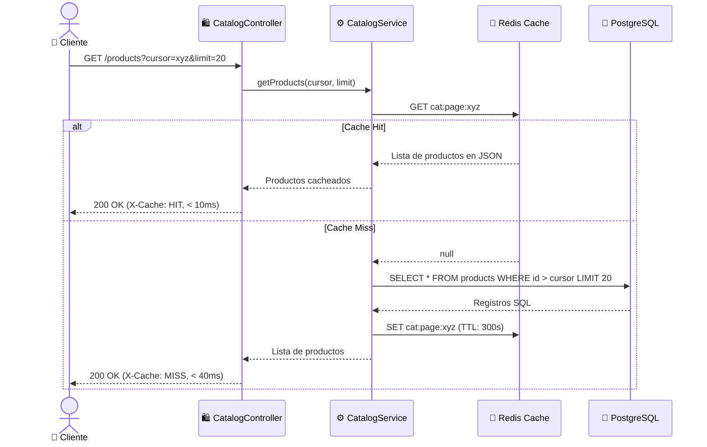

# Flujo de Secuencia: backend (Consulta de Catálogo con Caché)

```mermaid
sequenceDiagram
    actor Cliente as 👤 Cliente
    participant Cat as 🛍️ CatalogController
    participant Svc as ⚙️ CatalogService
    participant Redis as 🔴 Redis Cache
    participant DB as 🐘 PostgreSQL

    Cliente->>Cat: GET /products?cursor=xyz&limit=20
    Cat->>Svc: getProducts(cursor, limit)
    Svc->>Redis: GET cat:page:xyz
    
    alt Cache Hit
        Redis-->>Svc: Lista de productos en JSON
        Svc-->>Cat: Productos cacheados
        Cat-->>Cliente: 200 OK (X-Cache: HIT, < 10ms)
    else Cache Miss
        Redis-->>Svc: null
        Svc->>DB: SELECT * FROM products WHERE id > cursor LIMIT 20
        DB-->>Svc: Registros SQL
        Svc->>Redis: SET cat:page:xyz (TTL: 300s)
        Svc-->>Cat: Lista de productos
        Cat-->>Cliente: 200 OK (X-Cache: MISS, < 40ms)
    end
```
