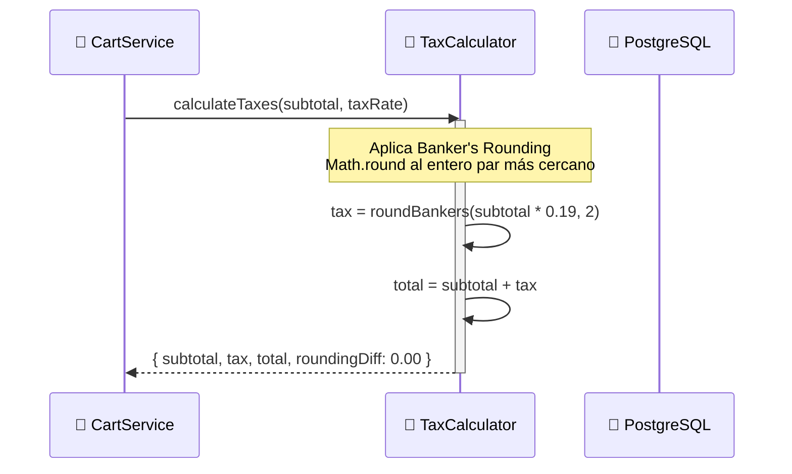

# Flujo de Secuencia: billing (Liquidación de Impuestos y Redondeo Contable)

```mermaid
sequenceDiagram
    participant Cart as 🛒 CartService
    participant TaxCalc as 📐 TaxCalculator
    participant DB as 🐘 PostgreSQL

    Cart->>TaxCalc: calculateTaxes(subtotal, taxRate)
    activate TaxCalc
    Note over TaxCalc: Aplica Banker's Rounding<br>Math.round al entero par más cercano
    TaxCalc->>TaxCalc: tax = roundBankers(subtotal * 0.19, 2)
    TaxCalc->>TaxCalc: total = subtotal + tax
    TaxCalc-->>Cart: { subtotal, tax, total, roundingDiff: 0.00 }
    deactivate TaxCalc
```
