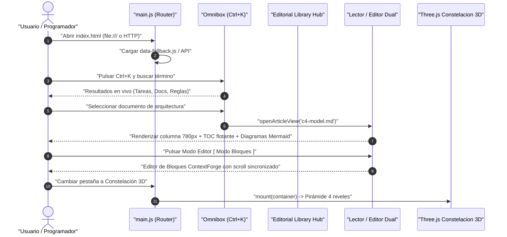

# Flujo de Renderizado y Navegación: dashboard-visualizer

```mermaid
sequenceDiagram
  autonumber
  actor User as "Usuario / Programador"
  participant App as "main.js (Router)"
  participant Omnibox as "Omnibox (Ctrl+K)"
  participant Library as "Editorial Library Hub"
  participant Article as "Lector / Editor Dual"
  participant ThreeD as "Three.js Constelacion 3D"

  User->>App: "Abrir index.html (file:/// o HTTP)"
  App->>App: "Cargar data-fallback.js / API"
  User->>Omnibox: "Pulsar Ctrl+K y buscar término"
  Omnibox-->>User: "Resultados en vivo (Tareas, Docs, Reglas)"
  User->>Omnibox: "Seleccionar documento de arquitectura"
  Omnibox->>Article: "openArticleView('c4-model.md')"
  Article-->>User: "Renderizar columna 780px + TOC flotante + Diagramas Mermaid"
  User->>Article: "Pulsar Modo Editor [ Modo Bloques ]"
  Article-->>User: "Editor de Bloques ContextForge con scroll sincronizado"
  User->>App: "Cambiar pestaña a Constelación 3D"
  App->>ThreeD: "mount(container) -> Pirámide 4 niveles"
```

