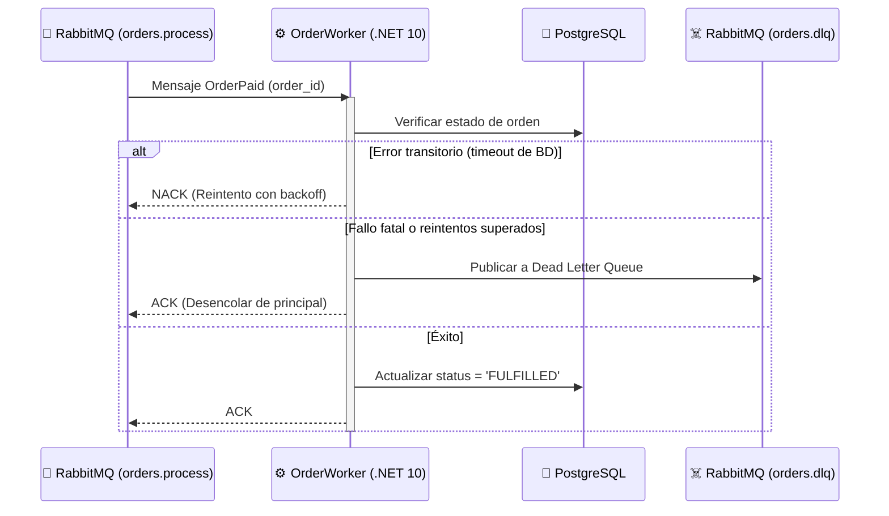

# Flujo de Secuencia: infra (Procesamiento de Órdenes en Worker)

```mermaid
sequenceDiagram
    participant Queue as 🐇 RabbitMQ (orders.process)
    participant Worker as ⚙️ OrderWorker (.NET 10)
    participant DB as 🐘 PostgreSQL
    participant DLQ as ☠️ RabbitMQ (orders.dlq)

    Queue->>Worker: Mensaje OrderPaid (order_id)
    activate Worker
    Worker->>DB: Verificar estado de orden
    
    alt Error transitorio (timeout de BD)
        Worker-->>Queue: NACK (Reintento con backoff)
    else Fallo fatal o reintentos superados
        Worker->>DLQ: Publicar a Dead Letter Queue
        Worker-->>Queue: ACK (Desencolar de principal)
    else Éxito
        Worker->>DB: Actualizar status = 'FULFILLED'
        Worker-->>Queue: ACK
    end
    deactivate Worker
```
