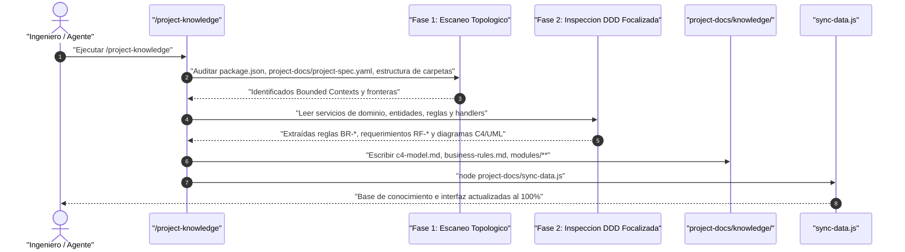

# Flujo de Elicitación y Extracción: knowledge-engine

```mermaid
sequenceDiagram
  autonumber
  actor User as "Ingeniero / Agente"
  participant Skill as "/project-knowledge"
  participant Phase1 as "Fase 1: Escaneo Topologico"
  participant Phase2 as "Fase 2: Inspeccion DDD Focalizada"
  participant Storage as "project-docs/knowledge/"
  participant Sync as "sync-data.js"

  User->>Skill: "Ejecutar /project-knowledge"
  Skill->>Phase1: "Auditar package.json, project-docs/project-spec.yaml, estructura de carpetas"
  Phase1-->>Skill: "Identificados Bounded Contexts y fronteras"
  Skill->>Phase2: "Leer servicios de dominio, entidades, reglas y handlers"
  Phase2-->>Skill: "Extraídas reglas BR-*, requerimientos RF-* y diagramas C4/UML"
  Skill->>Storage: "Escribir c4-model.md, business-rules.md, modules/**"
  Skill->>Sync: "node project-docs/sync-data.js"
  Sync-->>User: "Base de conocimiento e interfaz actualizadas al 100%"
```
