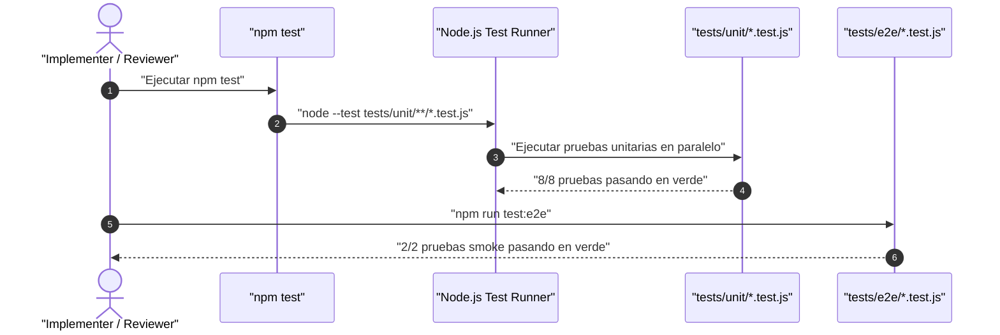

# Flujo de Verificación Continua: testing-qa-suite

```mermaid
sequenceDiagram
  autonumber
  actor Runner as "Implementer / Reviewer"
  participant NPM as "npm test"
  participant RunnerNative as "Node.js Test Runner"
  participant UnitTests as "tests/unit/*.test.js"
  participant SmokeTests as "tests/e2e/*.test.js"

  Runner->>NPM: "Ejecutar npm test"
  NPM->>RunnerNative: "node --test tests/unit/**/*.test.js"
  RunnerNative->>UnitTests: "Ejecutar pruebas unitarias en paralelo"
  UnitTests-->>RunnerNative: "8/8 pruebas pasando en verde"
  Runner->>SmokeTests: "npm run test:e2e"
  SmokeTests-->>Runner: "2/2 pruebas smoke pasando en verde"
```

