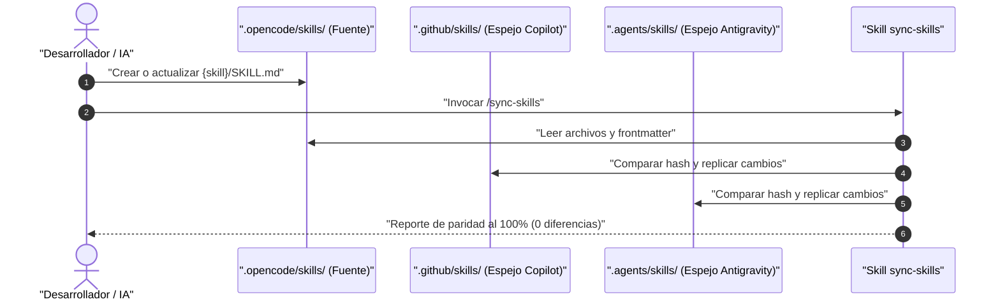

# Flujo de Sincronización Triple: triple-sync-engine

```mermaid
sequenceDiagram
  autonumber
  actor Dev as "Desarrollador / IA"
  participant Truth as ".opencode/skills/ (Fuente)"
  participant MirrorCopilot as ".github/skills/ (Espejo Copilot)"
  participant MirrorAGY as ".agents/skills/ (Espejo Antigravity)"
  participant SyncTool as "Skill sync-skills"

  Dev->>Truth: "Crear o actualizar {skill}/SKILL.md"
  Dev->>SyncTool: "Invocar /sync-skills"
  SyncTool->>Truth: "Leer archivos y frontmatter"
  SyncTool->>MirrorCopilot: "Comparar hash y replicar cambios"
  SyncTool->>MirrorAGY: "Comparar hash y replicar cambios"
  SyncTool-->>Dev: "Reporte de paridad al 100% (0 diferencias)"
```

